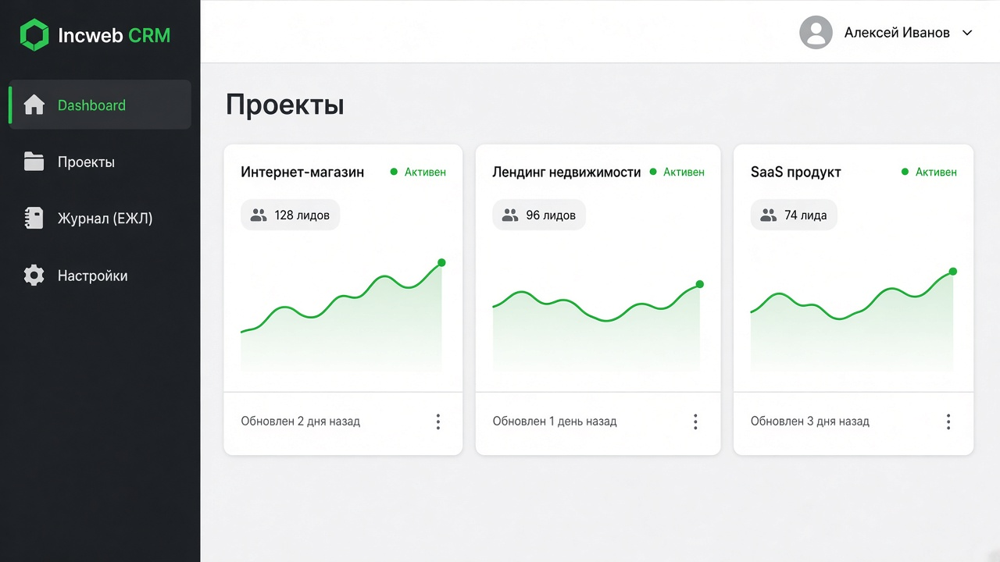
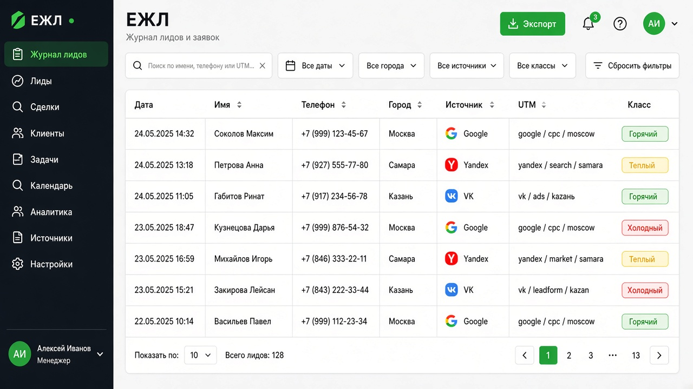
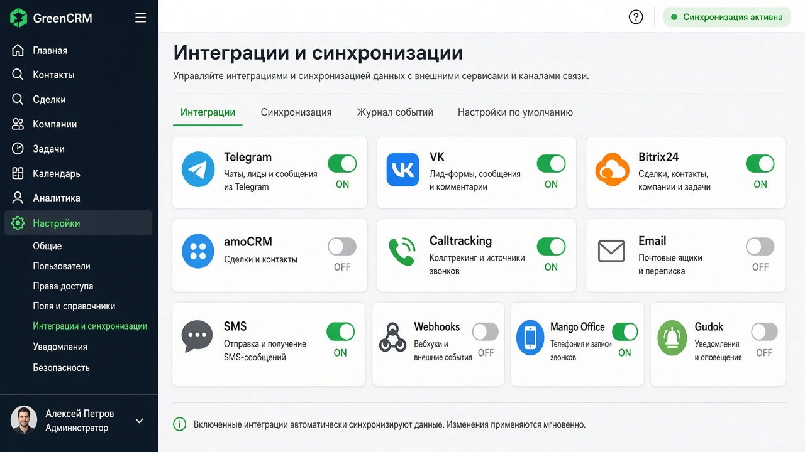
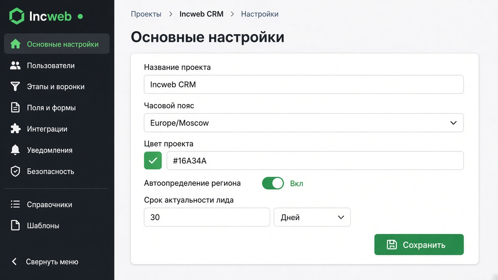

# Incweb CRM

<p align="center">
  
</p>

<p align="center">
  <strong>CRM для сбора, обработки и маршрутизации лидов</strong><br>
  Laravel · Vue 3 · Material Dashboard · Docker
</p>

<p align="center">
  
  
  
  
</p>

---

**Incweb CRM** — система управления лидами для маркетинговых и продажных команд. Принимает заявки с сайтов и рекламных каналов, ведёт единый журнал лидов (ЕЖЛ), уведомляет менеджеров и отправляет данные во внешние CRM и мессенджеры.

## Возможности

| Модуль | Описание |
|--------|----------|
| **Проекты** | Несколько проектов с отдельными настройками, хостами и правами доступа |
| **ЕЖЛ** | Журнал лидов с фильтрами, классами, комментариями и экспортом в Excel |
| **API v1 / v2** | REST API для приёма лидов, управления проектами и интеграциями |
| **Уведомления** | Email, SMS, Telegram — по шаблонам и правилам проекта |
| **Вебхуки** | Обычные webhook’и, Bitrix24, amoCRM |
| **Интеграции** | VK-формы, Calltracking, Mango Office, Gudok, Matomba |
| **Аналитика** | UTM-метки, источники, регион, Yandex Metrika (`client_id` / `user_id`) |
| **Безопасность** | Токены проектов, роли (admin / manager / watcher), чёрный список IP |

## Скриншоты

> Иллюстративные макеты интерфейса (Material Dashboard). Замените на реальные скрины после деплоя при необходимости.

### Панель проектов



### Единый журнал лидов (ЕЖЛ)



### Интеграции и синхронизации



### Настройки проекта



## Стек технологий

**Backend:** PHP 8+, Laravel 8, Redis, Laravel Horizon, Spatie Media Library / Backup, Maatwebsite Excel, Telebot, Swagger (l5-swagger)

**Frontend:** Vue 3, Vuex, Bootstrap / Material Dashboard, Laravel Mix, Axios, Laravel Echo + Pusher

**Инфраструктура:** Docker (Nginx, PHP-FPM 8.1, MySQL 8, Redis)

## Быстрый старт (Docker)

```bash
git clone https://github.com/t1mon/incweb-crm.git
cd incweb-crm
cp .env.example .env
```

Отредактируйте `.env` (БД, Redis, `APP_URL`). Для Docker обычно:

```env
DB_HOST=mysql
DB_DATABASE=laravel
DB_USERNAME=root
DB_PASSWORD=secret
REDIS_HOST=redis
QUEUE_CONNECTION=redis
```

Запуск контейнеров:

```bash
docker-compose up -d --build
# или для Ubuntu-варианта:
# docker-compose -f docker-compose-ubuntu.yml up -d --build
```

Внутри контейнера CLI:

```bash
docker-compose exec php81-cli bash
composer install
php artisan key:generate
php artisan migrate --seed
php artisan storage:link
php artisan horizon:install
```

Сборка фронтенда (на хосте или в контейнере с Node):

```bash
yarn install
yarn dev   # или yarn prod
```

Приложение: [http://localhost](http://localhost) (порт зависит от `docker-compose*.yml`).

### Учётная запись после сидов

```yml
email: 1@1.ru
password: 123456
```

## Полезные команды

```bash
# Тесты
./vendor/bin/phpunit

# Code style
./vendor/bin/php-cs-fixer fix --config=.php_cs --verbose --dry-run --diff

# Очереди
php artisan horizon

# Бэкап
php artisan backup:run

# Список API-маршрутов
php artisan route:list --path=api

# Пересборка БД (только dev)
php artisan migrate:fresh --seed
```

## API

API версионируется (`/api/v1`, `/api/v2`). Аутентификация — Bearer-токен пользователя или токен проекта (для приёма лидов).

```bash
# Пример: приём лида (v2)
curl -X POST "https://your-host/api/v2/lead/add" \
  -H "Authorization: Bearer <token>" \
  -H "X-Requested-With: XMLHttpRequest" \
  -H "Content-Type: application/json" \
  -d '{"project_id":1,"phone":"+79001234567","name":"Иван"}'
```

Swagger-документация доступна через пакет `darkaonline/l5-swagger` после публикации и генерации.

Полный список маршрутов:

```bash
php artisan route:list --path=api
```

## Интеграции

| Канал | Назначение |
|-------|------------|
| **Telegram** | Мгновенные уведомления в личные чаты и группы |
| **Email / SMS** | Рассылка по шаблонам проекта |
| **VK** | Приём лидов из VK-форм |
| **Bitrix24 / amoCRM** | Исходящие вебхуки в CRM |
| **Calltracking** | Лиды с телефонных звонков |
| **Mango / Gudok / Matomba** | Телефония и внешние сервисы |

Подробная настройка Telegram: [docs/telegram-integration.md](docs/telegram-integration.md).

## Структура проекта (кратко)

```text
app/
  Http/Controllers/Api/V1|V2/   # REST API
  Models/Project/               # Проекты, лиды, интеграции
  Jobs/ Listeners/ Services/    # Очереди и бизнес-логика
resources/
  js/                           # Vue 3
  views/material-dashboard/     # Blade UI
docker/                         # Nginx, PHP-FPM, MySQL
routes/api.php                  # API v1 / v2
```

## Переменные окружения

Ключевые параметры (см. `.env.example`):

| Переменная | Описание |
|------------|----------|
| `APP_NAME` | Название приложения (`Incweb`) |
| `DB_*` / `REDIS_*` | База и кэш/очереди |
| `QUEUE_CONNECTION` | Рекомендуется `redis` |
| `PUSHER_*` | Broadcasting в реальном времени |
| `TELEGRAM_*` | Бот и webhook Telegram |
| `SMS_*` | Провайдер SMS (sms.ru) |

## Лицензия

MIT. См. [LICENSE](LICENSE).

## Вклад в проект

Issue и Pull Request приветствуются. Перед PR:

1. `yarn lint` / PHP-CS-Fixer  
2. `./vendor/bin/phpunit`  
3. Краткое описание изменений в PR  

---

**Incweb CRM** — единая точка сбора лидов для сайтов, рекламы и телефонии.
